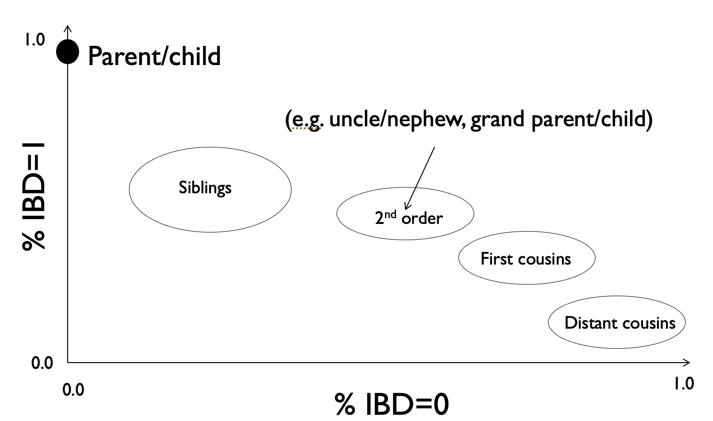
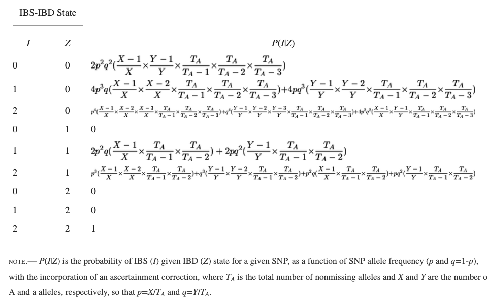

# 5.3 Computing expected IBD - plink method

In the previous section we looked the expected IBD sharing for different relative pairs. Here, we will look at a method to estimate the percent IBD sharing for a pair of individuals given their genotype data. From that, we can infer what type of relatives they might be, e.g. according to the relationships below:

This method is implemented in plink and described in [Purcell et al. 2007](https://www.ncbi.nlm.nih.gov/pmc/articles/PMC1950838/).

## Plink method of moments - intuition

For IBD estimation, our input will be the unphased SNP genotypes (0s, 1s, and 2s) for a pair of individuals. Our goal is to output the percent of the genomes that are shared at each IBD level (0, 1, or 2).

An initial idea is to simply count the number of SNPs whose genotypes are shared at *IBS* of 0, 1, or 2, which we can easily compute based on observed SNP genotypes. However, this will not be sufficient! Many SNPs might be shared IBS just by chance, even if they are not on large IBD segments with a recent common ancestor. This would cause us to overestimate *IBD*, and we'll need to account for this.

Let $i \in \{0, 1, 2\}$ be the IBS for a pair of genotypes, and  $z \in \{0, 1, 2\}$ be the IBD. We can write:

$$P(IBS=i) = \sum_{z \in \{0, 1, 2\}} P(IBS=i|IBD=z)P(IBD=z)$$

where:
* $P(IBD=z)$, the fraction of the genome shared $IBD=z$, is the unknown quantity we'd like to estimate. We will be able to rearrange this set of equations (one each for $P(IBS=0), P(IBS=1), P(IBS=2))$ to solve for $P(IBD=0), P(IBD=1), P(IBD=2))$
* $P(IBS=i)$ is the fraction of SNPs shared at $IBS=i$. This is something we directly observe from the genotypes.
* $P(IBS=i|IBD=z)$, the probability to observe a SNP at $IBS=i$ given $IBD=z$, is something we'll be able to model (see below) using principles from Hardy-Weinberg Equilibrium. This quantity will be averaged overall SNPs:

$$P(IBS=i|IBD=z) = \frac{1}{m} \sum_m P_m (IBS=i|IBD=z)$$

where $P_m(IBS=i|IBD=z)$ is the probability to observe SNP $m$ at $IBS=i$ given $IBD=z$.

## Trivial case - IBD=2

For a single SNP $m$ at $IBD=2$, we know that if IBD is 2 then IBS must also be 2 (the genotypes will be identical) and so we get:

* $P_m(IBS=0|IBD=2) = 0$
* $P_m(IBS=1|IBD=2) = 0$
* $P_m(IBS=2|IBD=2) = 1$

## Next case - IBD=0

If IBD is 0, then it must mean any observed IBS for a pair of genotypes at a particular SNP can be explained by chance. We can use Hardy-Weinberg Equilibrium to help us with this. Recall:

If we have a single SNP with alleles 0 at frequency $p$ and 1 with frequency $q=1-p$, then we can estimate the frequency of each possible genotype as:

* Freq(00) = $p^2$
* Freq(01) = $2pq$
* Freq(11) = $q^2$

Now we can use that same logic to estimate the probability to see a particular *pair* of genotypes for two people at a given SNP, e.g.:

* P(00, 00) = $p^4$ (IBS=2)
* P(00, 01) = $2p^3q$ (IBD=1)
* P(00, 11) = $p^2q^2$ (IBS=0)

We can write out all possible pairs of genotypes for each IBS state to determine $P(IBS=i|IBD=z)$.

For IBS=0, we have:
* $P_m(IBS=0|IBD=0) = 2p^2q^2$ since we have possible genotype pairs:
  * 00, 11 ($p^2q^2$)
  * 11, 00 ($q^2p^2$)
* $P_m(IBS=1|IBD=0) = 4p^3q+4pq^3$ with pairs:
  * 00, 01 ($2p^3q$)
  * 11, 01 ($2q^3p$)
  * 01, 00 ($2p^3q$)
  * 01, 11 ($2q^3p$)
* $P_m(IBS=2|IBD=0) = p^4+q^4 + 4p^2q^2$ with pairs:
  * 00, 00 ($p^4$)
  * 11, 11 ($q^4$)
  * 01, 01 ($4p^2q^2$)

All cases are presented in the table below. (We didn't work out here the case of IBD=1). Note in practice plink applies a sample size correction, which is why there are extra terms below:

Source: https://www.ncbi.nlm.nih.gov/pmc/articles/PMC1950838/

## Solving the system of equations

Once we have the quantities above, we can solve the system of equations. First we do this for the case where $IBS=0$:

$$P(IBS=0) = P(IBS=0|IBD=0)P(IBD=0) + ...$$
$$   P(IBS=0|IBD=1)P(IBD=1) + ...$$
$$   P(IBS=0|IBD=2)P(IBD=2)$$

But the second two terms $P(IBS=0|IBD=1)P(IBD=1)$ and $P(IBS=0|IBD=2)P(IBD=2)$ are 0. We can rearrange to get:

$$P(IBD=0) = \frac{P(IBS=0)}{P(IBS=0|IBD=0)}$$

where $P(IBS=0)$ is the fraction of observed SNPs with IBS=0 and $P(IBS=0|IBD=0)=\frac{1}{m}P_m(IBS=0|IBD=0)$ can be calculated based on the Hardy Weinberg expectation described above. Intuitively, if we observe fewer SNPs than expected at IBS=0, then a lower percentage of the genome is shared at IBD=0.

You can similarly work out the system of equations to get the relationships below. Note below we use e.g. $N(IBS=i)$ to denote the number of observed SNPs at that IBS level (whereas above, we used e.g. $P(IBS=i)$ to indicate the fraction of SNPs observed at that IBS level).

$$P(IBD=1) = \frac{N(IBS=1)-N(IBS=1|IBD=0)P(IBD=0)}{N(IBS=1|IBD=1)}$$

$$P(IBD=2) = \frac{N(IBS=2)-N(IBS=2|IBD=0)P(IBD=0)-P(IBS=2|IBD=1)P(IBD=1)}{N(IBS=2|IBD=2)}$$

## Summary

Given unphased SNP genotypes for a pair of individuals, as well as minor allele frequencies for each SNP, you could derive the IBS sharing at each SNP and use that to estimate the percent of the genome two individuals share at IBD=0, 1, or 2. Based on those percentages, you could infer the possible familial relationship (see the plot above of percent IBD=0 vs. percent IBD=1).
