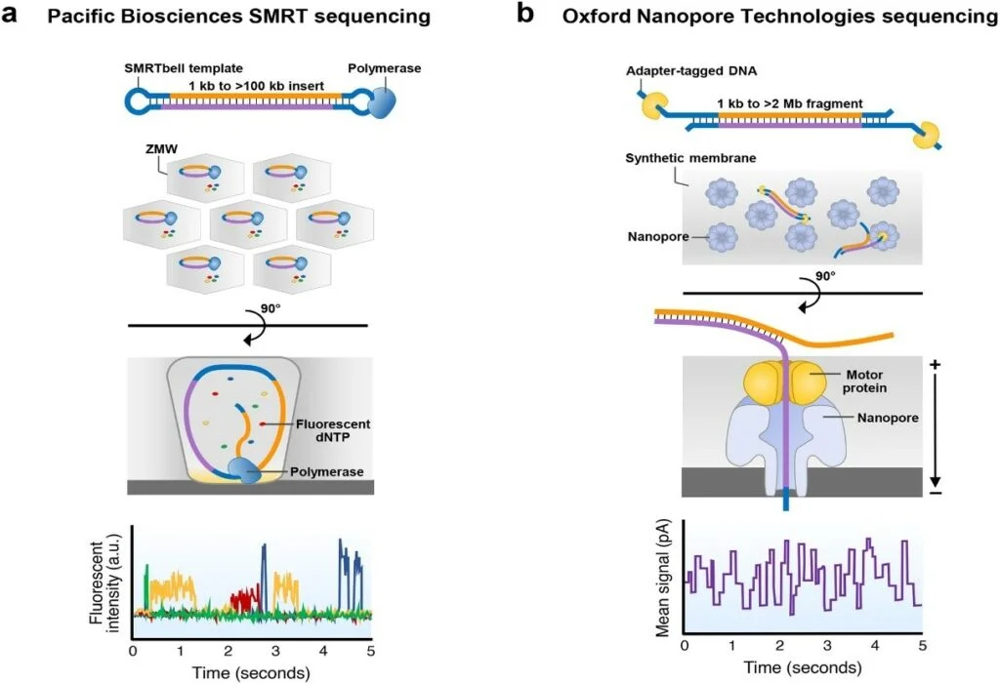

# 2.3 Long-read technologies

The vast majority of available whole genome sequencing (WGS) datasets currently are from Illumina technology. While NGS can genotype many types of genetic variation, there are ultimately regions of the genome that cannot be fully captured using short sequence of 150bp or so. This mostly includes long, complex repetitive regions such as telomeres or centromeres, but also large regions of the genome that are duplicated in multiple places.

Long-read technologies now generate reads that are many kilobases long. These have been used to fill remaining gaps in the human reference genome, and gain a much deeper knowledge of structural variation among human genomes. There is a tradeoff though: the longest reads still have far higher per-base error rates (10-15%). Thus, while they are useful for learning big picture genome organization, accurate identification of individual SNPs is challenging. However, long-read technology is rapidly improving, and error rates are expected to continue to fall.

There are currently two main technologies for long-read sequencing:

Source:[Oxford Global](https://oxfordglobal.com/omics/resources/advances-in-long-read-dna-sequencing) 

* **Oxford Nanopore Technologies (ONT)**: ONT works by taking long pieces of DNA (*high molecular weight* DNA) and threading them through a small hole called a nanopore. Each base generates a characteristic electrical signal, which can be used to infer the sequence of bases being threaded through. ONT can generate impressively long read lengths, but with generally higher error rates than Pacbio or Illumina.

* **Pacific Biosciences (PacBio)**: Pacbio has small wells with a polymerase attached to the bottom. High molecular weight DNA is passed through this polymerase, and a laser generates a signal that can be converted to base calls as the sequence passes through the polymerase and bases are added. PacBio can be run in two modes. In both modes, DNA fragments are first converted to circular molecules. (1) *Continuous long read sequencing (CLR)*: this mode generates very long reads (20kb-175kb+) with error rates around 10%. Each DNA fragment is read only once. (2) *Circular consensus sequence (CCS)* (also known as "hifi"). In this mode, somewhat shorter sequences (<20kb) are sequenced. But, the fragment is read multiple times by sequencing around the circular fragment. By reading the same fragment multiple times, errors can be corrected, resulting in low error rates of around 1%.
